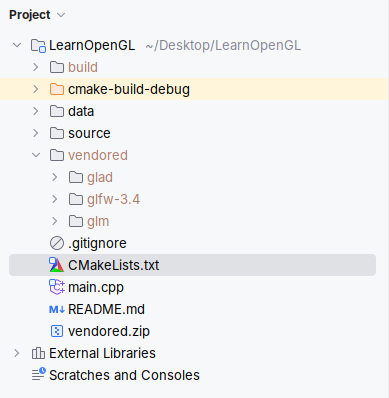
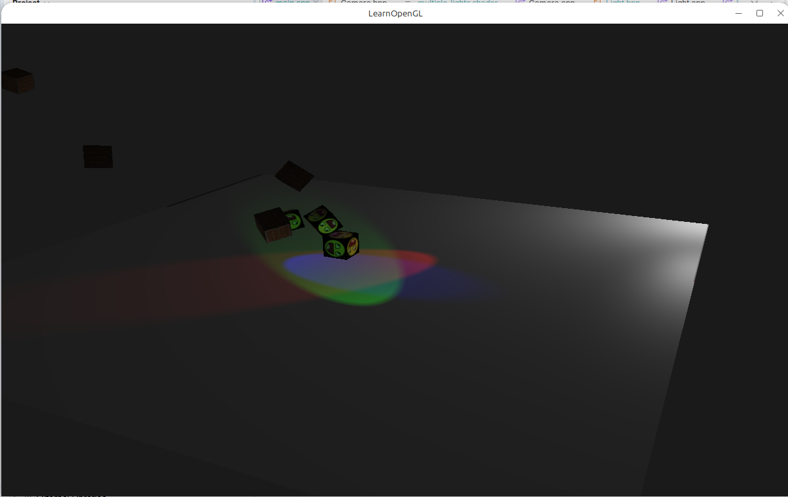
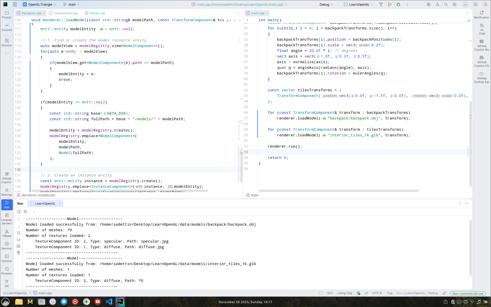
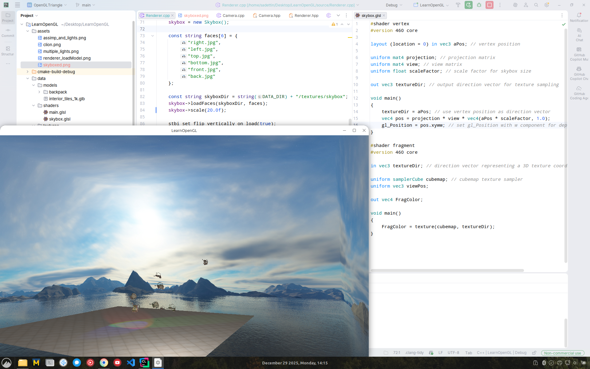

my codes for learnopengl.com tutorials
===============================================

This repository contains my implementations and experiments based on the tutorials from [learnopengl.com](https://learnopengl.com/). The tutorials cover a wide range of topics in OpenGL programming, from basic rendering to advanced techniques.

Building and Running
---------------------
To build and run the code, follow these steps:
1. Clone the repository:
   ```
   git@github.com:sfidan42/LearnOpenGL.git
   ```
2. Navigate to the project directory:
   ```
    cd LearnOpenGL
   ```
3. Unzip vendored.zip to get the required dependencies:
    ```
    unzip vendored.zip
    ```
4. Open the project in Clion.



5. Screenshots of the project:
   1. After finishing "Lighting" section of the book:
    
   2. After finishing "Model Loading" section of the book:
    
   3. Proper model loading using ECS architecture:
    
   4. After adding Skybox
    
